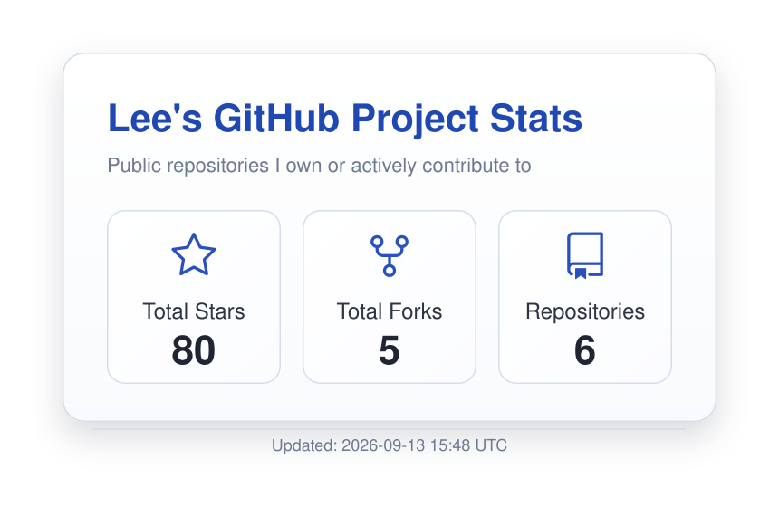

<h1>Hi 👋, I'm Lee</h1>

I am a second-year Ph.D. student in the State Key Lab of CAD&CG, ZJU.

My research interests lie in **World Model** and **Robot Learning**.

 

<em>S’all good, man.</em>

  

